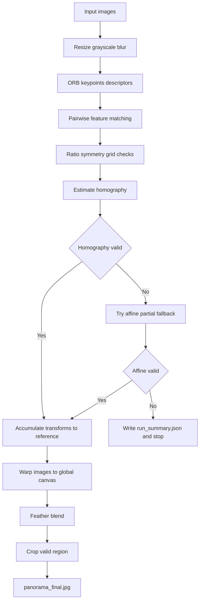
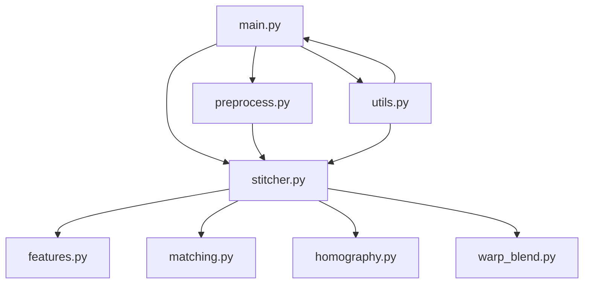

# Panorama Stitching with ORB

Project này hiện thực bài toán ghép ảnh toàn cảnh (panorama stitching) bằng `Python + OpenCV`, dùng `ORB` làm phương pháp trích xuất đặc trưng chính. Mục tiêu là ghép một chuỗi ảnh chụp liên tiếp thành một ảnh panorama cuối cùng, đồng thời lưu đủ ảnh và log trung gian để phục vụ phân tích và viết báo cáo.

## Panorama Preview


## Project làm gì
Pipeline hiện tại gồm các bước:
- đọc và resize ảnh đầu vào,
- chuyển grayscale và tiền xử lý nhẹ,
- trích keypoints/descriptors bằng ORB,
- so khớp đặc trưng giữa các cặp ảnh kề nhau,
- ước lượng `homography` với fallback `affine partial` khi cần,
- tích lũy transform về ảnh tham chiếu,
- warp toàn bộ ảnh lên cùng canvas,
- feather blend các vùng chồng lấn,
- crop phần viền đen để tạo ra ảnh panorama cuối cùng.

Phiên bản hiện tại đã được tinh chỉnh để chạy ổn định với bộ ảnh trong `input/`.

## Pipeline Diagram


## Module Diagram


## Cấu trúc thư mục
```text
.
├── configs/
│   └── default.yaml
├── assets/
│   └── panorama_final.jpg
├── input/
├── output/
├── src/
│   ├── main.py
│   ├── preprocess.py
│   ├── features.py
│   ├── matching.py
│   ├── homography.py
│   ├── warp_blend.py
│   ├── stitcher.py
│   └── utils.py
└── README.md
```

## Yêu cầu môi trường
- Python 3.10+
- OpenCV
- NumPy
- PyYAML

## Cách chạy
Chạy từ thư mục gốc của repo:

```bash
python3 -m src.main --input_dir input --output_dir output --config configs/default.yaml
```

## Kết quả đầu ra
Sau khi chạy thành công, thư mục `output/` sẽ có:
- `panorama_final.jpg`: ảnh panorama cuối cùng đã crop viền đen
- `run_summary.json`: log toàn bộ pipeline
- các ảnh debug:
  - keypoints từng ảnh
  - raw matches
  - good matches
  - inlier matches

## Các giả định hiện tại
- Ảnh trong `input/` phải có thứ tự đúng theo chuỗi chụp.
- Với bộ dữ liệu đang dùng, ảnh được chụp theo hướng `right_to_left` theo thứ tự tên file tăng dần.
- Nếu ảnh bị xáo trộn thứ tự, pipeline hiện tại không tự sắp xếp lại.

## Một vài quyết định kỹ thuật
- Dùng `ORB` để bám sát yêu cầu bài tập và giữ chi phí tính toán thấp.
- Không match trực tiếp ảnh mới với panorama đã ghép. Thay vào đó, hệ thống match các cặp ảnh gốc kề nhau rồi mới tích lũy transform.
- Có fallback từ `Homography` sang `AffinePartial2D` khi `Homography` cho hình học không hợp lý.
- Feather blending được xây trên `distance transform` để hạn chế viền đen bị kéo vào vùng chồng lấn.

## Giới hạn hiện tại
- Chưa tự suy luận thứ tự ảnh.
- Chưa có bundle adjustment.
- Chưa có seam finding tối ưu hoặc exposure compensation.
- Chưa có detector thứ hai để so sánh như `SIFT` hoặc `SURF`.

