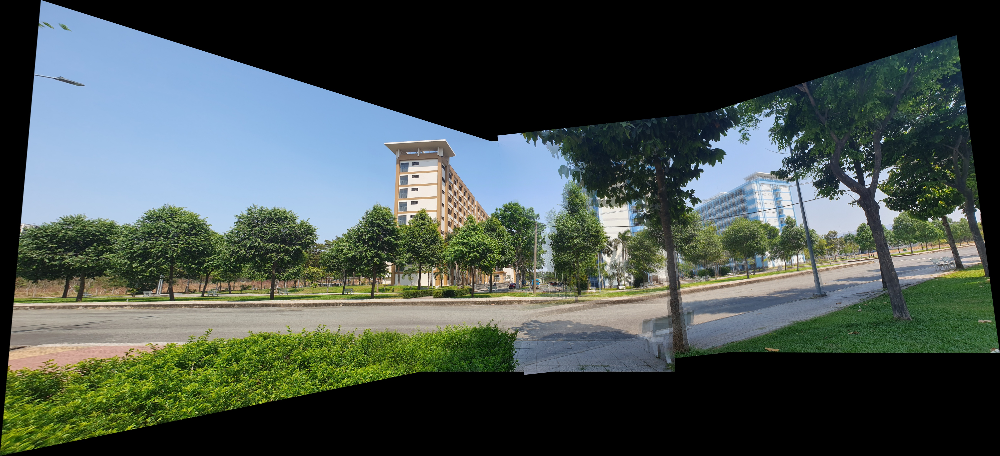
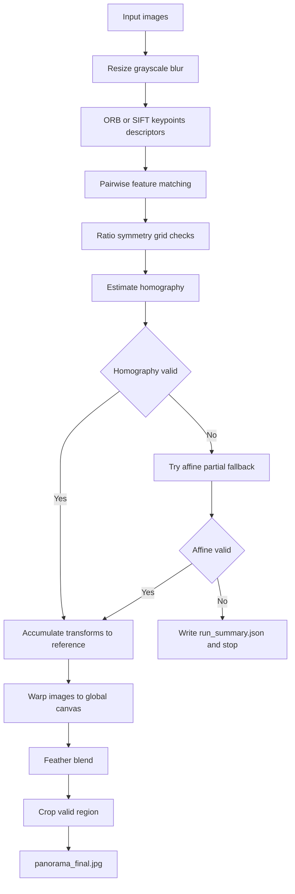
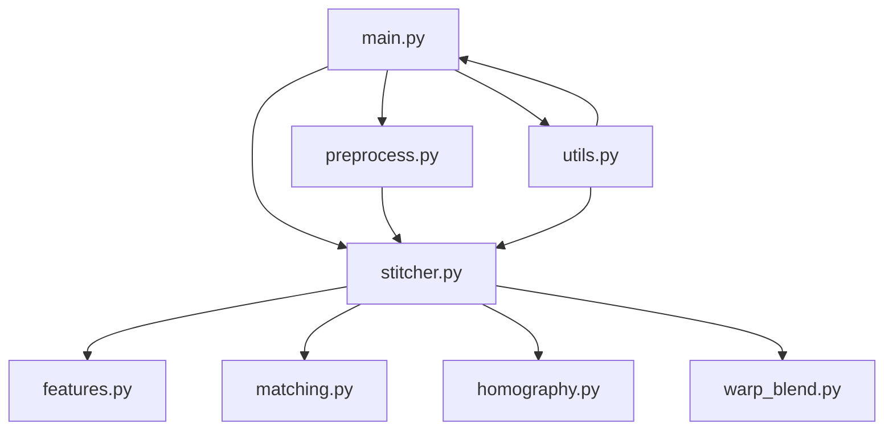

# Panorama Stitching with ORB and SIFT

Project này hiện thực bài toán ghép ảnh toàn cảnh (panorama stitching) bằng `Python + OpenCV`, với hai backend trích xuất đặc trưng là `ORB` và `SIFT`. Mục tiêu là ghép một chuỗi ảnh chụp liên tiếp thành một ảnh panorama cuối cùng, đồng thời lưu đủ ảnh và log trung gian để phục vụ phân tích và viết báo cáo.

## Panorama Preview



## Project làm gì
Pipeline hiện tại gồm các bước:
- đọc và resize ảnh đầu vào,
- chuyển grayscale và tiền xử lý nhẹ,
- trích keypoints/descriptors bằng ORB hoặc SIFT,
- so khớp đặc trưng giữa các cặp ảnh kề nhau,
- ước lượng `homography` với fallback `affine partial` khi cần,
- tích lũy transform về ảnh tham chiếu,
- warp toàn bộ ảnh lên cùng canvas,
- feather blend các vùng chồng lấn,
- crop phần viền đen để tạo ra ảnh panorama cuối cùng.

Phiên bản hiện tại đã được tinh chỉnh để chạy ổn định với các bộ ảnh đặt trong `input/`.

## Pipeline Diagram


## Module Diagram


## Cấu trúc thư mục
```text
.
├── configs/
│   └── default.yaml
├── assets/
│   └── panorama_final.jpg
├── input/
│   ├── base/
│   ├── l1/
│   └── l2/
├── output/
│   ├── base/
│   ├── l1/
│   └── l2/
├── src/
│   ├── main.py
│   ├── preprocess.py
│   ├── features.py
│   ├── matching.py
│   ├── homography.py
│   ├── warp_blend.py
│   ├── stitcher.py
│   └── utils.py
└── README.md
```

## Yêu cầu môi trường
- Python 3.10+
- OpenCV
- NumPy
- PyYAML

## Cách chạy
Chạy từ thư mục gốc của repo:

```bash
python3 -m src.main --input_dir input --output_dir output --config configs/default.yaml
```

Script sẽ:
- nếu `input/` chứa ảnh trực tiếp, ghi kết quả vào `output/<tên_thư_mục_input>/`,
- nếu `input/` chứa nhiều thư mục con như `base/`, `l1/`, `l2/`, tự chạy từng bộ và ghi ra `output/base/`, `output/l1/`, `output/l2/`.

Ví dụ chạy riêng một bộ:

```bash
python3 -m src.main --input_dir input/l1 --output_dir output --config configs/default.yaml
```

Chạy với backend `SIFT`:

```bash
python3 -m src.main --feature sift --input_dir input --output_dir output --config configs/default.yaml
```

Khi chọn `--feature sift`, pipeline sẽ tự chuyển sang bộ tham số matching phù hợp cho descriptor float:
- `FLANN + L2`
- `ratio = 0.75`
- `max_good_matches = 200`
- phát hiện đặc trưng trên ảnh resize về `detection_width = 600`, sau đó scale keypoint trở lại hệ tọa độ ảnh gốc

## Kết quả đầu ra
Sau khi chạy thành công, mỗi thư mục dataset trong `output/<dataset_name>/` sẽ có:
- `panorama_final.jpg`: ảnh panorama cuối cùng đã crop viền đen
- `run_summary.json`: log toàn bộ pipeline
- các ảnh debug:
  - keypoints từng ảnh
  - raw matches
  - good matches
  - inlier matches

Nếu chạy nhiều dataset cùng lúc từ `input/`, thư mục `output/` còn có thêm `batch_summary.json`.

## Các giả định hiện tại
- Ảnh trong từng thư mục dataset phải có thứ tự đúng theo chuỗi chụp.
- `configs/default.yaml` hiện cho phép override theo từng dataset:
  - `base`: `right_to_left`
  - `l1`: `left_to_right`
  - `l2`: `left_to_right` và ưu tiên `affine_partial` ở pairwise estimation để tránh projective drift
- Mặc định chung không khóa cứng hướng chụp; nếu cần có thể thêm dataset mới vào `dataset_overrides`.
- Nếu ảnh bị xáo trộn thứ tự, pipeline hiện tại không tự sắp xếp lại.

## Một vài quyết định kỹ thuật
- Dùng `ORB` làm mặc định để giữ chi phí tính toán thấp; `SIFT` được tích hợp như backend thay thế khi cần độ ổn định matching cao hơn.
- Không match trực tiếp ảnh mới với panorama đã ghép. Thay vào đó, hệ thống match các cặp ảnh gốc kề nhau rồi mới tích lũy transform.
- Có fallback từ `Homography` sang `AffinePartial2D` khi `Homography` cho hình học không hợp lý.
- Feather blending được xây trên `distance transform` để hạn chế viền đen bị kéo vào vùng chồng lấn.

## Giới hạn hiện tại
- Chưa tự suy luận thứ tự ảnh.
- Chưa có bundle adjustment.
- Chưa có seam finding tối ưu hoặc exposure compensation.
- Chưa tích hợp cylindrical projection hoặc bundle refinement riêng cho SIFT.
